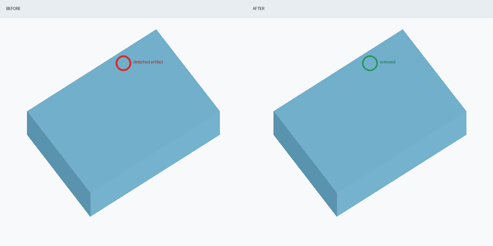
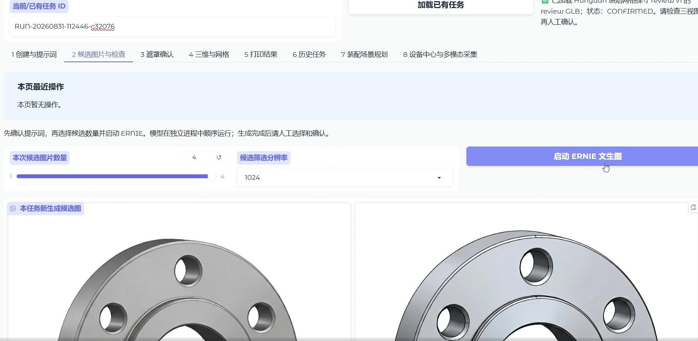
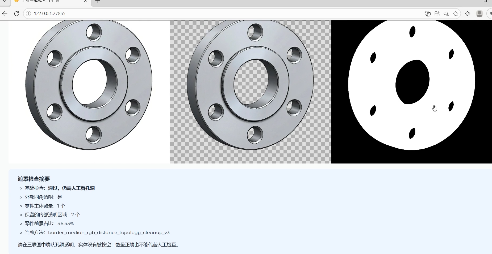
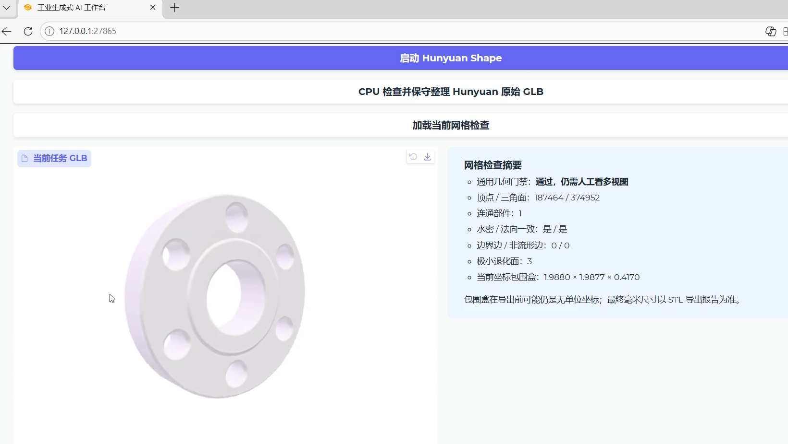
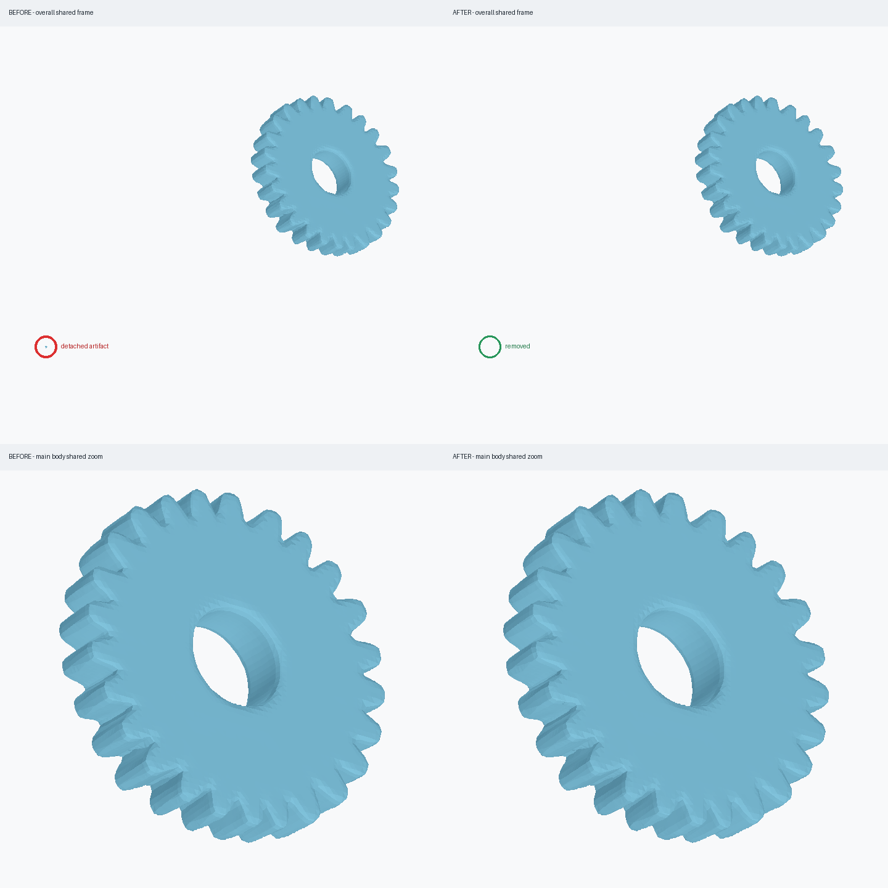
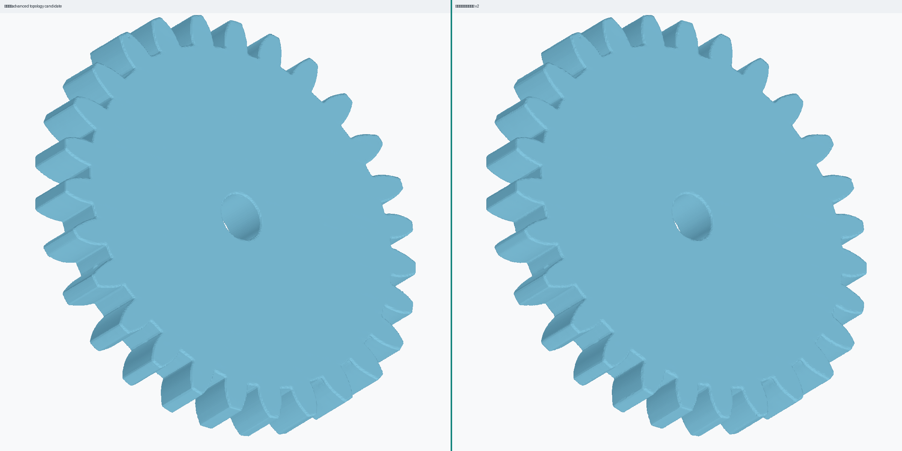
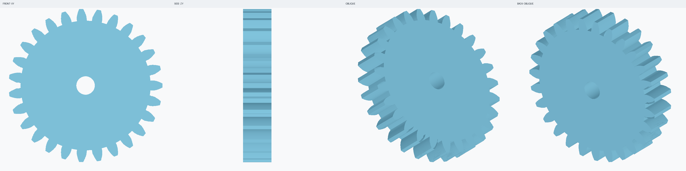

# Industrial Generative AI Workflow

[](https://github.com/Orangemoon-arch/industrial-generative-ai-workflow/actions/workflows/ci.yml)

面向工业零件的生成式 AI 工作流原型：在单张 RTX 3060 12GB 上，顺序调用文生图、视觉语言模型和图生三维模型，并通过版本化任务、确定性检查和人工门禁，把不稳定的生成结果整理为可追踪的工程候选。

> 这是经过整理的个人作品集版本。模型权重、虚拟环境、上游仓库、现场设备配置和原始实验数据不包含在本仓库中。

## 项目概览


核心目标不是把“模型返回成功”当成工程成功，而是建立：

- GPU 任务串行化和运行前资源检查；
- 输入、请求、日志、产物和 SHA256 的版本化追踪；
- 图片、遮罩、网格和导出阶段的人工门禁；
- 水密性、连通部件、边界边、非流形边、退化面、体积和尺寸检查；
- safe / standard / advanced / reconstruction 分级修复、试算和失败回滚；
- 生成式参考与参数化工程重建之间的明确边界。

## 三分钟 CPU Demo

不需要 GPU、模型权重或完整 Web 环境，即可运行真实的独立伪影诊断与安全清理逻辑：

```bash
python3 -m venv .demo-venv
.demo-venv/bin/python -m pip install -r requirements-geometry.txt
.demo-venv/bin/python demo/run_mesh_repair_demo.py
```

Demo 会确定性生成一个包含微小独立伪影的 GLB，输出修复候选、完整 JSON 报告和同视角对比图，并验证原始 GLB 的 SHA256 未改变。脚本拒绝覆盖非空输出目录。



示例产物位于 [`demo/example_output/`](demo/example_output/)，详细说明见 [`demo/README.md`](demo/README.md)。

## 我的工作

- 在 RTX 3060 12GB 上部署并顺序验证 ERNIE-Image、Qwen3-VL-8B-Instruct、Hunyuan3D-2.1 Shape 和 Hunyuan3D-2mv。
- 使用 Gradio 和 FastAPI 实现任务创建、候选生成、检查、遮罩、单图/多图生三维、网格复核、修复和产物下载。
- 实现 GPU 预检、文件锁、单线程队列、短生命周期模型子进程和任务内路径/SHA256 校验。
- 实现通用 GLB 诊断与分级修复，包括小孔限制、异常碎片清理、非流形处理、表面距离与尺寸门禁。
- 完成涵道风扇从文生图到 Bambu Lab A1 PLA 打印的端到端验证，并针对齿轮开展多视图重建、参数提取和参数化重建实验。

## Web 工作台

Gradio 前端把原本分散的模型脚本组织成带人工门禁的任务流程。任务 ID、当前阶段和历史产物都保存在版本化清单中，重新加载任务后可以继续检查，而不是依赖一次性页面状态。

### 候选图片生成与检查

页面支持选择候选数量和分辨率，顺序启动 ERNIE；生成完成后仍需经过 Qwen 风险提示和人工确认。



### 透明遮罩检查

进入三维生成前，同时展示原图、透明 RGBA 和二值遮罩，并报告前景占比和内部透明区域，防止背景或孔洞被错误送入重建模型。



### 三维网格复核

Hunyuan 输出不会直接标记为可用模型。页面同时展示 GLB 和连通部件、水密性、法向、边界边、非流形边、退化面与包围盒指标，并要求人工查看多视图。



## 代表性结果

### 资源验证

三个模型严格顺序运行，峰值不能相加：

| 模型 | 配置 | 计算进程显存峰值 | 结果 |
|---|---|---:|---|
| ERNIE-Image-Turbo | 768×768，8 steps | 约 1.05 GiB | 通过 |
| Qwen3-VL-8B | NF4 4-bit | 约 6.42 GiB | 通过 |
| Hunyuan3D-2.1 Shape | FP16 + CPU offload | 约 6.89 GiB | 通过 |
| Hunyuan3D-2mv | FP16 + CPU offload | reserved 约 3.31–3.52 GiB | 通过 |

Hunyuan 的整卡峰值曾达到约 7.24 GiB，其中包含桌面图形基础占用；表中数据采用模型计算进程口径。

### 网格修复

真实单图 Hunyuan 输出中的远离主体伪影被移除，同时通过局部换边消除退化三角形；主体顶点不移动，原始模型不覆盖。



等距重网格能改善三角形质量，但不能凭空恢复精确渐开线齿形。因此项目会把“拓扑健康”和“工程语义正确”分开报告。



对于已知齿数、模数、压力角、孔径和厚度的齿轮，参数化重建比继续平滑生成式网格更可靠。



## 代码结构

```text
apps/
├── industrial-ai-service/   # Gradio、FastAPI、适配器、网格修复和测试
├── ernie-image/             # ERNIE 短生命周期任务工作进程
├── qwen3-vl/                # Qwen 检查工作进程与确定性归一化规则
└── hunyuan-workers/         # Hunyuan 周边预处理、检查、导出和重建脚本
assets/                      # 脱敏后的代表性结果
demo/                        # 无 GPU 可运行示例与确定性示例输出
docs/                        # 技术边界和复现说明
```

详细模块说明见 [服务实现文档](apps/industrial-ai-service/README.md)，接口说明见 [FastAPI 文档](apps/industrial-ai-service/README_API.md)。

## 测试与验证

项目开发阶段的代表性结果：

- Service 层回归测试：78 项通过；
- 本作品仓包含的几何修复、参数提取与重建专项测试：24 项通过；
- Gradio `build_app()` 可成功构建；
- FastAPI OpenAPI 包含文生图、单图/多图生三维、状态查询和产物下载路由。
- GitHub Actions 在 Python 3.10 上自动执行语法、README 资源、服务层、几何层和 CPU Demo 检查。

完整 GPU 工作流依赖本地模型目录和各自独立的虚拟环境，本作品仓不提供权重。CPU 网格工具可在安装 `requirements-geometry.txt` 后独立阅读和试验。

## 工程结论

- 视觉语言模型可以辅助筛查，但不能替代机械计数和人工确认。
- 多视图重建能改善不可见厚度和碎片问题，但不会自动修正输入图片的错误齿数。
- 水密、法向一致和单连通只表示基础拓扑健康，不表示孔径、公差、齿形和装配关系正确。
- 精确功能件应优先使用参数化 CAD/结构重建；生成式模型更适合概念探索与结构参考。

## 第三方依赖说明

本仓库只包含个人编写和整理的工作流代码，不重新分发模型权重或完整上游项目。运行完整链路时需由使用者自行按照相应官方许可证获取：

- ERNIE-Image / ERNIE-Image-Turbo
- Qwen3-VL
- Hunyuan3D-2.1 / Hunyuan3D-2mv
- Gradio、FastAPI、PyTorch、trimesh、PyMeshLab 等开源依赖

本项目为实习期研究与竞赛流程验证原型，不是生产系统，也不构成打印或机械安全批准。
